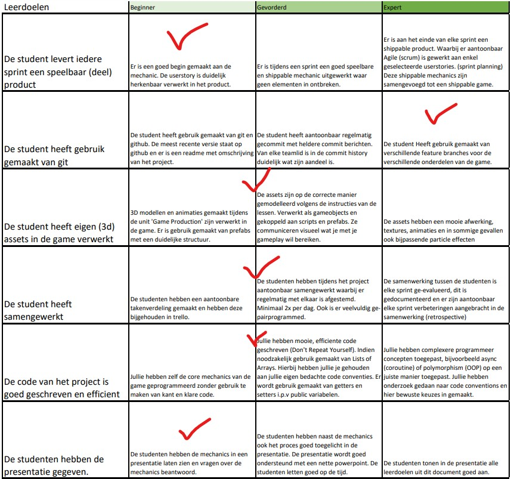

# BO opdracht F2M3 - Arcade Mechanics

## Introductie
In deze beroepsopdracht is het doel het maken van verschillende shippable mechanics voor een game. Deze mechanics moeten zo volledig mogelijk zijn, met zelfgemaakte assets, code, sound effects, etc.

## Mechanics

* Vliegen: Als UFO kan je eje door een 2,5D level bewegen met de knoppen A, D, Spatie & L-Shift.
* Bommen gooien: Met linkermuisknop kan je een bom laten vallen, die vervolgens explodeert en gebouwen in de buurt opblaast en uit elkaar laat spatten.

## Rubrix op 01/04/2022

